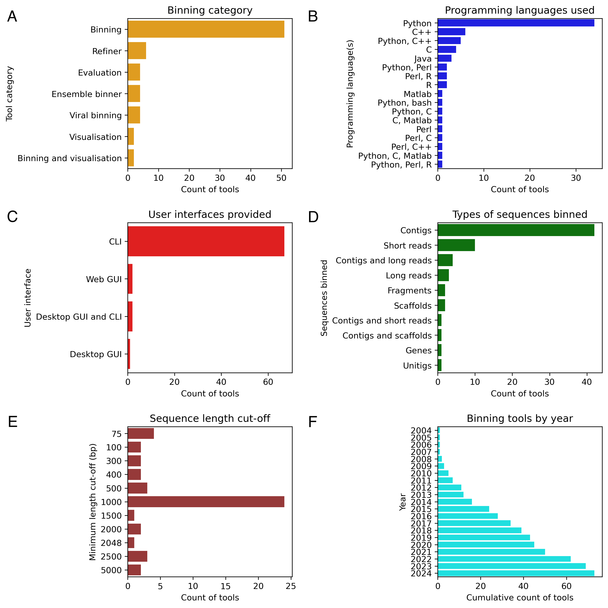

# Solving genomic puzzles: computational methods for metagenomic binning
This repository contains the code and data used to analyse and plot metadata of metagenomic binning tools.

## Overview

Metagenomics is a field of study that focuses on analysing genetic material directly from microbial communities in their natural environments. This approach has provided valuable insights into the structure, diversity, and ecology of these communities.

After sequencing and processing an environmental sample, metagenomic binning is used to cluster the sequences into bins that represent different taxonomic groups, such as species or genera. Several computational tools have been developed to automate this process, enabling the recovery of novel draft genomes of microorganisms. These tools allow researchers to study the behaviours and functions of these organisms within their microbial communities.

This review classifies and analyses various approaches to metagenomic binning, as well as the refinement, visualisation, and evaluation techniques used by these methods.

<p align="center">
  
</p>

## Summary of tools

The figure below summarises the tools found in [Metagenomic_binning_tools_to_consider.csv](https://github.com/metagentools/metagenomic_binning_review/blob/main/data/Metagenomic_binning_tools_to_consider.csv) which contains all the tools included in the review.

<p align="center">
  
</p>

## Citation

The review paper has been published in [Briefings in Bioinformatics](https://academic.oup.com/bib/article/25/5/bbae372/7724458). DOI: [10.1093/bib/bbae372](https://doi.org/10.1093/bib/bbae372). If you refer to this paper, please cite as follows.

> Vijini Mallawaarachchi, Anuradha Wickramarachchi, Hansheng Xue, Bhavya Papudeshi, Susanna R Grigson, George Bouras, Rosa E Prahl, Anubhav Kaphle, Andrey Verich, Berenice Talamantes-Becerra, Elizabeth A Dinsdale and Robert A Edwards. Solving genomic puzzles: computational methods for metagenomic binning. Briefings in Bioinformatics, Volume 25, Issue 5, September 2024, bbae372, DOI: https://doi.org/10.1093/bioinformatics/btaa180

```bibtex
@article{10.1093/bib/bbae372,
    author = {Mallawaarachchi, Vijini and Wickramarachchi, Anuradha and Xue, Hansheng and Papudeshi, Bhavya and Grigson, Susanna R and Bouras, George and Prahl, Rosa E and Kaphle, Anubhav and Verich, Andrey and Talamantes-Becerra, Berenice and Dinsdale, Elizabeth A and Edwards, Robert A},
    title = "{Solving genomic puzzles: computational methods for metagenomic binning}",
    journal = {Briefings in Bioinformatics},
    volume = {25},
    number = {5},
    pages = {bbae372},
    year = {2024},
    month = {07},
    abstract = "{Metagenomics involves the study of genetic material obtained directly from communities of microorganisms living in natural environments. The field of metagenomics has provided valuable insights into the structure, diversity and ecology of microbial communities. Once an environmental sample is sequenced and processed, metagenomic binning clusters the sequences into bins representing different taxonomic groups such as species, genera, or higher levels. Several computational tools have been developed to automate the process of metagenomic binning. These tools have enabled the recovery of novel draft genomes of microorganisms allowing us to study their behaviors and functions within microbial communities. This review classifies and analyzes different approaches of metagenomic binning and different refinement, visualization, and evaluation techniques used by these methods. Furthermore, the review highlights the current challenges and areas of improvement present within the field of research.}",
    issn = {1477-4054},
    doi = {10.1093/bib/bbae372},
    url = {https://doi.org/10.1093/bib/bbae372},
    eprint = {https://academic.oup.com/bib/article-pdf/25/5/bbae372/58697331/bbae372.pdf},
}
```
