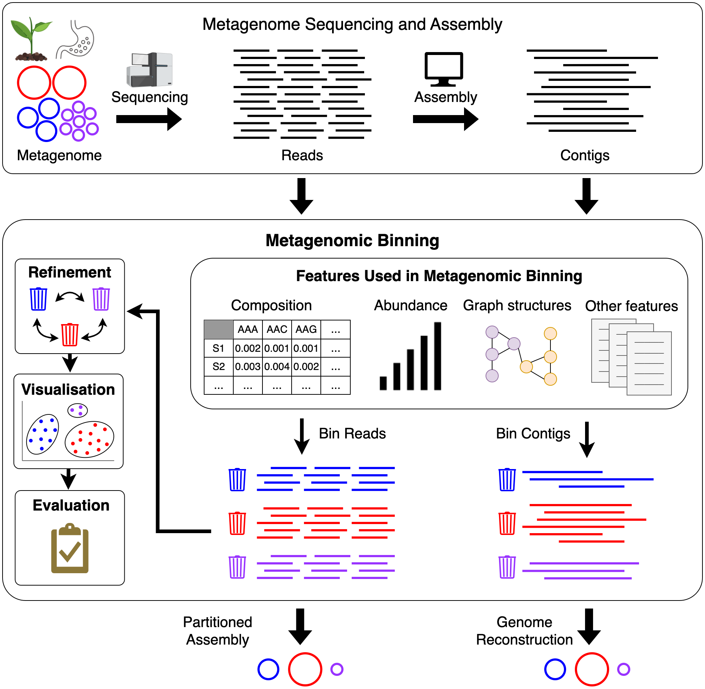
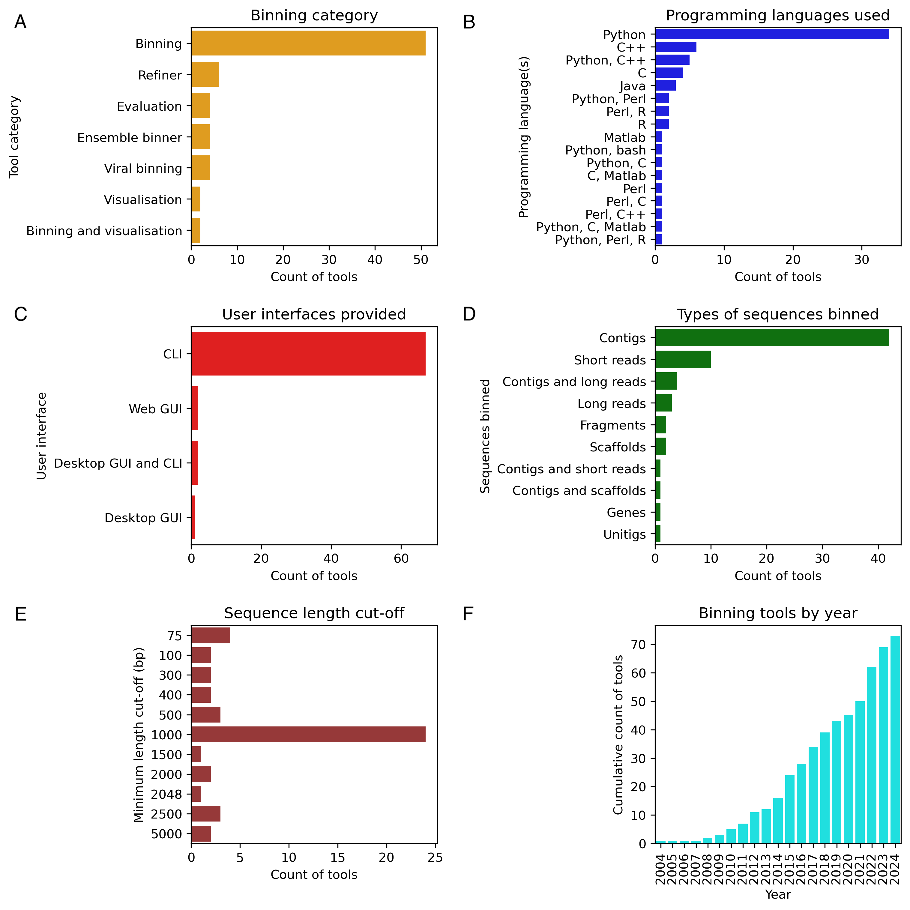

# Solving Genomic Puzzles: Computational Methods for Metagenomic Binning
This repository contains the code and data used to analyse and plot metadata of metagenomic binning tools.

## Overview

Metagenomics is a field of study that focuses on analysing genetic material directly from microbial communities in their natural environments. This approach has provided valuable insights into the structure, diversity, and ecology of these communities.

After sequencing and processing an environmental sample, metagenomic binning is used to cluster the sequences into bins that represent different taxonomic groups, such as species or genera. Several computational tools have been developed to automate this process, enabling the recovery of novel draft genomes of microorganisms. These tools allow researchers to study the behaviours and functions of these organisms within their microbial communities.

This review classifies and analyses various approaches to metagenomic binning, as well as the refinement, visualisation, and evaluation techniques used by these methods.

  

## Summary of tools

The figure below summarises the tools found in [Metagenomic_binning_tools_to_consider.csv](https://github.com/metagentools/metagenomic_binning_review/blob/main/Metagenomic_binning_tools_to_consider.csv) which contains all the tools included in the review.

  

## Citation

The manuscript is currently in preparation.
